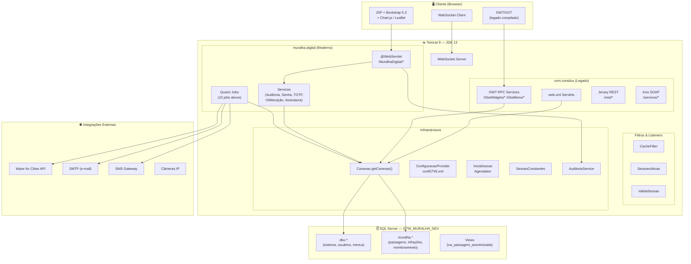
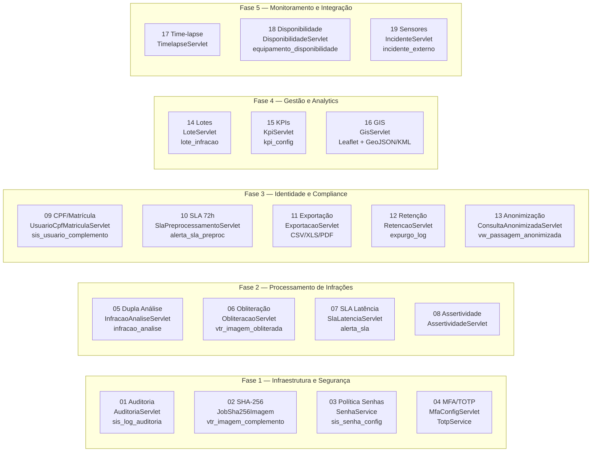

# Arquitetura do Sistema GTW-CWB

Diagramas Mermaid da arquitetura completa do sistema GTW clássico + Muralha Digital.

---

## 1. Visão Geral — Camadas



---

## 2. Módulos Muralha Digital — PoC TRANSALVADOR



---

## 3. Quartz Jobs — Agendamento

```mermaid
gantt
    title Jobs Quartz — Intervalos de Execução
    dateFormat X
    axisFormat %s min

    section PoC
    SHA-256 Integridade (5 min)       :a1, 0, 5
    SLA Latência (5 min)              :a2, 0, 5
    Disponibilidade Equip (10 min)    :a3, 0, 10
    Incidentes Waze (30 min)          :a4, 0, 30
    SLA Pré-proc 72h (60 min)        :a5, 0, 60
    Retenção Dados (1440 min)         :a6, 0, 60

    section Notificações
    E-mail Alertas (1 min)            :b1, 0, 1
    E-mail Ocorrências (1 min)        :b2, 0, 1
    SMS Alertas (5 min)               :b3, 0, 5
    SMS Ocorrências (5 min)           :b4, 0, 5

    section Legado
    Processa Automático (10 min)      :c1, 0, 10
    Agendamento Infração (10 min)     :c2, 0, 10
```



---

## 4. Banco de Dados — Tabelas PoC

```mermaid
erDiagram
    sis_usuario ||--o{ sis_log_auditoria : "registra"
    sis_usuario ||--o| sis_usuario_complemento : "1:1 complemento"
    sis_senha_config }o--|| sis_usuario : "politica"

    sis_usuario_complemento {
        int id_usuario PK
        varchar senha_hash
        int tentativas_invalidas
        datetime bloqueado_ate
        varchar totp_secret
        bit totp_habilitado
        varchar cpf
        varchar matricula
    }

    sis_log_auditoria {
        bigint id PK
        int id_usuario FK
        varchar funcionalidade
        varchar operacao
        datetime dt_operacao
    }

    sis_senha_config {
        int id PK
        varchar chave
        varchar valor
    }

    veiculo_tempo_real ||--o{ vtr_imagem_complemento : "hash SHA-256"
    veiculo_tempo_real ||--o{ infracao_analise : "dupla análise"
    veiculo_tempo_real ||--o{ vtr_status_analise : "status"
    veiculo_tempo_real ||--o{ vtr_imagem_obliterada : "obliteração"

    infracao_analise {
        bigint id PK
        bigint id_passagem FK
        int id_usuario_analista FK
        varchar classificacao
        int ordem_analise
        datetime dt_analise
    }

    vtr_imagem_obliterada {
        bigint id PK
        bigint id_imagem FK
        int x
        int y
        int largura
        int altura
    }

    infracao_imagem_obliteracao {
        bigint id PK
        bigint id_passagem FK
        int id_usuario FK
        datetime dt_obliteracao
    }

    alerta_sla {
        bigint id PK
        int total_passagens
        numeric media_ms
        numeric maximo_ms
        int threshold_ms
        bit violado
        datetime dt_alerta
    }

    alerta_sla_preproc {
        bigint id PK
        int total_pendentes
        int faixa_24h
        int faixa_48h
        int faixa_72h
        int faixa_acima
        datetime dt_snapshot
    }

    expurgo_log {
        bigint id PK
        varchar tabela
        bigint registros_removidos
        datetime dt_execucao
    }

    lote_infracao ||--o{ lote_infracao_item : "contém"

    lote_infracao {
        bigint id PK
        varchar codigo
        varchar descricao
        varchar status
        datetime dt_criacao
        datetime dt_envio
    }

    lote_infracao_item {
        bigint id PK
        bigint id_lote FK
        bigint id_passagem FK
    }

    kpi_config {
        int id PK
        varchar nome
        varchar query_sql
        varchar unidade
        numeric threshold_verde
        numeric threshold_amarelo
        int ordem
        bit ativo
    }

    equipamento_disponibilidade {
        bigint id PK
        int id_local FK
        bit disponivel
        datetime ultima_passagem
        int minutos_offline
        datetime dt_verificacao
    }

    incidente_externo {
        bigint id PK
        varchar fonte
        varchar tipo
        varchar descricao
        decimal latitude
        decimal longitude
        int severidade
        datetime dt_ocorrencia
    }

    config_chave_valor {
        int id PK
        varchar chave UK
        varchar valor
    }
```



---

## 5. Módulos Legados — Visão Geral

```mermaid
mindmap
  root((GTW-CWB))
    com.consilux
      conf
        ConfiguracaoProvider
        ConfiguracaoServlet
      infra
        Conexao
        SessaoConstantes
        ValidaSessao
        SessoesAtivas
        ServicoEmail
        CriptografiaAES
      lib
        DateUtil
        GenericCache
        QuartzConnectionProvider
      model
        527+ classes
        Jobs legados
        Modelos de domínio
      servlet
        ajax
        processamento
        relatorio
        remessa
        descarga
        medicao
        manutencao
        ferramentas
      ui.server
        GWT RPC Services
      rest
        Jersey JAX-RS
    muralha.digital
      57 módulos
      108 servlets
      10 Quartz jobs
      6 services
      WebSocket
